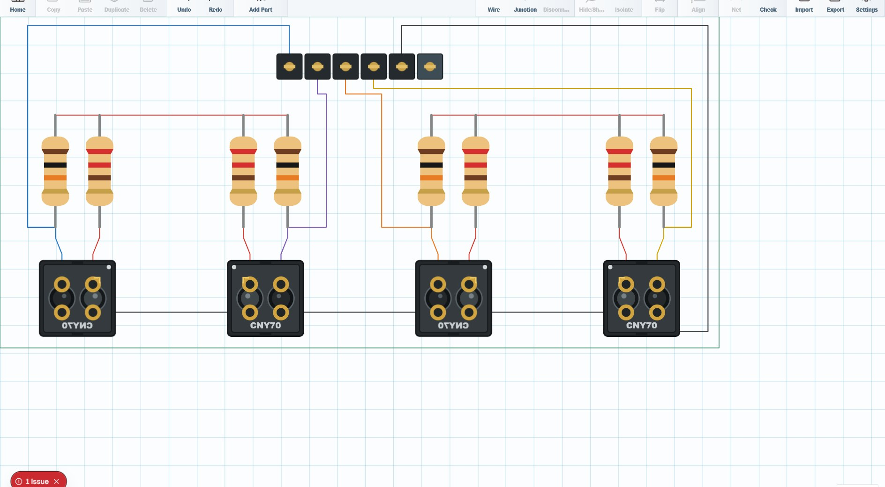
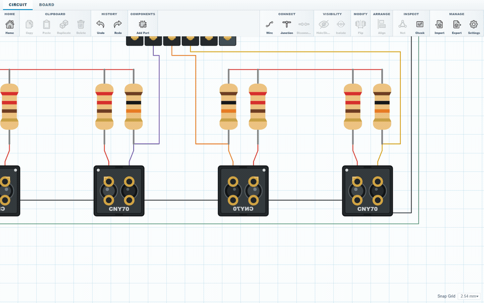

<div align="center">
  <table>
    <tr>
      <td width="145" align="center">
        
      </td>
      <td>
        <h1 align="right">SketchForge PCB</h1>
        <h3 align="right">A local-first PCB design editor that runs in your browser.</h3>
        <p align="right">
          Build circuits, place footprints, route connections, shape boards, inspect them in 3D, and export practical PCB files without accounts, cloud lock-in, or heavyweight EDA setup.
        </p>
      </td>
    </tr>
  </table>

  <p>
    <a href="LICENSE"></a>
    <a href="https://github.com/Formsmith746/SketchForge-PCB"></a>
    
    
  </p>
</div>



## Why SketchForge PCB

SketchForge PCB is a lightweight circuit and board workspace for people who want to move from an idea to a real PCB layout quickly.

It is built around a direct loop: add a component, choose its value and footprint, place it on the grid, wire the circuit, define the board, check the layout, inspect the result in 3D, then export the project or continue in another PCB tool.

No login. Projects stay in browser storage. No heavyweight EDA install just to sketch and iterate on a useful board.

## What It Does

- **Local-first projects** - PCB projects are stored in the browser and appear on the SketchForge PCB dashboard.
- **Circuit and board workspaces** - switch between logical circuit editing and the physical board layout.
- **Component and footprint library** - place supported through-hole and SMD parts, connectors, displays, sensors, ICs, LEDs, passives, and more.
- **Configurable parts** - change values, footprints, rotation, connector options, LED colours, and other supported component settings.
- **Wire and junction editing** - create routed multi-segment connections and intentional electrical branches.
- **Board drawing tools** - define the PCB outline, edit board geometry, create supported cutouts, and control board thickness.
- **Placement and routing tools** - flip, isolate, align, distribute, snap, inspect nets, and keep the design organized.
- **Design checks** - detect invalid connections, overlapping components, parts outside the board, route/body intersections, unintended pad contacts, crossings, and other layout problems.
- **3D board preview** - inspect the board, component models, holes, copper routing, and physical layout before export.
- **Native project format** - save and reopen editable `.sfpcb` projects with board geometry, components, values, wires, and junctions preserved.
- **KiCad workflows** - import supported `.kicad_pcb` boards and export KiCad 8-compatible PCB files with footprints, pads, copper tracks, drills, and Edge.Cuts.
- **Manufacturing and documentation exports** - generate Gerber packages, SVG board drawings, and CSV bills of materials.
- **OBJ geometry checks** - development tooling includes an open-edge test for exported PCB geometry.
- **Fast browser stack** - Next.js, React, TypeScript, Three.js, and polygon geometry tooling.

Current editor limitation: component placement and drawn routing are currently top-side only.

## Demo



## Getting Started

There are two common ways to run SketchForge PCB. If you are not sure which one to choose, use Docker.

| Path | Best for | Difficulty |
| --- | --- | --- |
| Docker / local server | Running SketchForge PCB on a computer, server, classroom, workshop, or LAN | Recommended |
| Local development | Developers who want to edit the code | Medium |

SketchForge PCB is local-first. The application is served locally, while projects are saved in the browser. Project and export files download through the browser; the editor does not require a SketchForge cloud account.

### Download the Project

If you already know Git and have access to the repository:

```bash
git clone https://github.com/Formsmith746/SketchForge-PCB.git
cd SketchForge-PCB
```

If you do not know Git yet:

1. Open the GitHub page for this repository.
2. Press the green **Code** button.
3. Press **Download ZIP**.
4. Extract the ZIP somewhere easy to find, such as your Desktop.
5. Open a terminal in the extracted folder.

On Windows, you can open PowerShell in the folder by opening the folder, clicking the address bar, typing `powershell`, and pressing Enter.

## Docker / Local Server (Recommended)

The Docker support follows the same deployment structure as SketchForge-3D. It builds the production Next.js standalone server into a container and can run either from a locally built image or the prebuilt image published to GitHub Container Registry.

### What You Need

- Docker Desktop on Windows or macOS, or Docker Engine on Linux
- Docker Compose, included with modern Docker Desktop

### Start SketchForge PCB

#### Compose (build locally)

From the SketchForge PCB project folder:

```bash
docker compose -f deploy/docker/compose.yaml up --build -d
```

#### Compose (prebuilt GitHub image)

```bash
docker compose -f deploy/docker/compose-ghcr.yaml up -d
```

The prebuilt image is:

```text
ghcr.io/formsmith746/sketchforge-pcb:latest
```

Because this repository is private, GitHub Container Registry may require authentication before pulling the image. If needed, authenticate to `ghcr.io` with a GitHub account/token that can read the package.

#### Standalone image

```bash
docker run -d --name sketchforge-pcb --restart unless-stopped \
  -p 3000:3000 \
  ghcr.io/formsmith746/sketchforge-pcb:latest
```

Open:

```text
http://127.0.0.1:3000/
```

Projects remain in each browser's local storage. Rebuilding or replacing the Docker container does not move PCB projects into the container.

### Let Other Computers Join

Other computers on the same LAN can open SketchForge PCB using the Docker host's local IP address:

```text
http://SERVER-IP:3000/
```

Make sure the host firewall allows the selected port.

To expose a different host port, set `SKETCHFORGE_PCB_PORT` before starting Compose. For example:

Windows PowerShell:

```powershell
$env:SKETCHFORGE_PCB_PORT = "8080"
docker compose -f deploy/docker/compose.yaml up --build -d
```

Linux or macOS:

```bash
SKETCHFORGE_PCB_PORT=8080 docker compose -f deploy/docker/compose.yaml up --build -d
```

Then open `http://127.0.0.1:8080/`.

### Stop SketchForge PCB

```bash
docker compose -f deploy/docker/compose.yaml down
```

### Update the Prebuilt Image

```bash
docker compose -f deploy/docker/compose-ghcr.yaml pull sketchforge-pcb
docker compose -f deploy/docker/compose-ghcr.yaml up -d --no-deps sketchforge-pcb
```

Every push to `main` runs `.github/workflows/docker.yml`, which uses the same GitHub Actions Docker pipeline as SketchForge-3D to build and push Linux AMD64 and ARM64 images to GHCR. It publishes branch, commit-SHA, and `latest` tags.

If Node.js is installed, the repository also includes the same convenience commands used by SketchForge-3D:

```bash
npm run docker:build
npm run docker:run
npm run docker:up
npm run docker:down
```

## Local Development

Use this path if you want to run SketchForge PCB or edit its code.

### What You Need

- Node.js 20 or newer
- npm, included with Node.js

Check your versions:

```bash
node -v
npm -v
```

If those commands do not work, install Node.js from the official Node.js website and reopen your terminal.

### Install and Run

From the SketchForge PCB project folder:

```bash
npm install
npm run dev
```

Open:

```text
http://127.0.0.1:3000/
```

Leave the terminal open while you use the app. To stop the development server, press `Ctrl+C` in the terminal.

### Useful Developer Commands

Run TypeScript checks:

```bash
npm run typecheck
```

Check generated OBJ geometry for open edges:

```bash
npm run test:obj-open-edges
```

Create a production build:

```bash
npm run build
```

## Contributing

Contributions are welcome. Good places to help include:

- circuit and board editor bug fixes
- component and footprint coverage
- routing and design-check improvements
- KiCad, Gerber, SVG, BOM, and native project interoperability
- 3D PCB preview and export geometry
- UI polish, accessibility, and performance
- documentation and examples

Keep changes focused, test the behavior you touched, and describe the user-visible result clearly when opening a pull request.

## Security

Please do not publish security-sensitive details in normal issue threads. Report security problems privately to the repository maintainers or through GitHub's private security reporting flow when it is available for the repository.

## License

Copyright © 2026 SketchForge contributors.

SketchForge PCB is licensed under the **GNU Affero General Public License v3.0**. If you modify SketchForge PCB and let users interact with the modified version over a network, the AGPL requires you to offer those users the corresponding source code under the same license. See [LICENSE](LICENSE).

## Optional: SketchForge PCB MCP Skill

The MCP integration is an optional AI/developer skill, not another way to install or normally use SketchForge PCB. The application itself runs through Docker or local development as described above.

For AI clients that support MCP tools, the included local skill can inspect and control a live development editor: list open editors, read the scene, inspect the component catalog, create or update board geometry, place and configure parts, route wires, add junctions, inspect design errors, and capture board images.

This skill is local-development tooling. Run SketchForge PCB with `npm run dev`; the editor communicates with the MCP bridge through the local `/api/sketchforge-pcb-mcp` route. Production builds and Docker are for running the application, not for the MCP skill.

### Start SketchForge PCB for MCP

From the SketchForge PCB project folder:

```bash
npm install
npm run dev
```

Open a PCB project in the browser:

```text
http://127.0.0.1:3000/
```

The AI client starts the MCP server with:

```bash
node scripts/sketchforge-pcb-mcp-server.mjs
```

or:

```bash
npm run mcp:sketchforge-pcb
```

### Codex

The project-local SketchForge PCB skill is included at:

```text
.agents/skills/sketchforge-pcb-mcp
```

It documents the live editor workflow, component discovery, board construction rules, routing requirements, inspection steps, and MCP tool usage.

When working from this repository, ask Codex to use the SketchForge PCB MCP skill, list the open PCB editors, inspect the target project, and make the requested changes through the live editor.

### Claude

Claude can use the same SketchForge PCB MCP server even though it does not use the Codex skill file directly. Configure Claude Desktop to launch the server with the absolute path to:

```text
scripts/sketchforge-pcb-mcp-server.mjs
```

After restarting Claude Desktop, ask it to list the open SketchForge PCB editors, inspect the target scene, and use the available SketchForge PCB MCP tools to make the requested PCB changes.

For board-generation work, always inspect the resulting circuit and board instead of treating electrical connectivity alone as proof that a design is complete or fabrication-ready.
